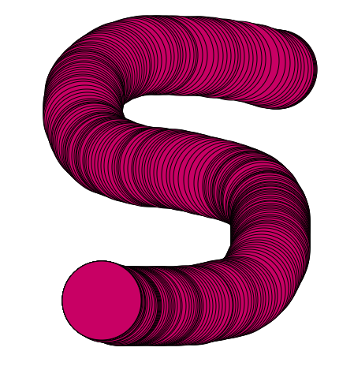
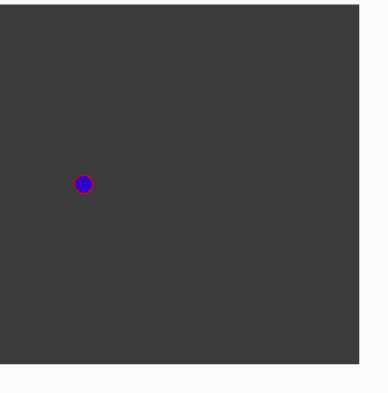
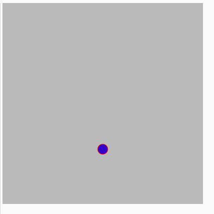
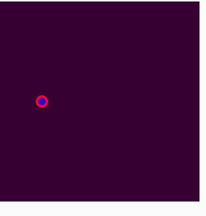
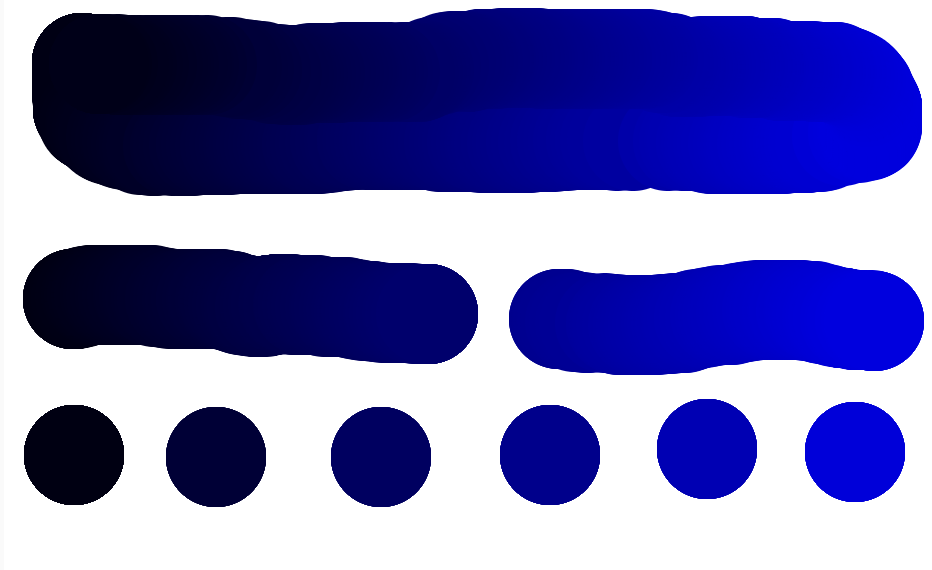

# Entry 2
##### 12/19/22

Over the past few weeks I have been learning my tool, p5js. I can say that I learnt many things during the past weeks. My sources for learning have been the [reference page on p5js](https://p5js.org/reference/) and [The Coding Train](https://www.youtube.com/playlist?list=PLglp04UYZK_PrN6xWo_nJ-8kzyXDyFUwi) on youtube who has a whole playlist of videos about p5js.

One of the first things I learned was about the `setup()` function and the `draw()` function. Set up was for setting up the canvas and everything else you initally want to appear on the canvas before anything is drawn on it. The canvas is where the output of the code is shown and when doing `createCanvas()` you can set the length and width of the canvas. Locations of the canvas are treated like x and y coordinates and usually the top left of the canvas is considered 0,0 (The origin point). This is important to know if you want to draw a certain shape in a certain position.

When watching The Coding Train I learned about p5js's reference library. This library contains all the different functions and how to use them. That is how I discovered `fill()` and `stroke()`. `fill()` will fill in a shape with the color stated in the () and `stroke()` controls the color of the outline of your shape. `strokeWeight()` will then control the thickness of the outline and if you want no outline you do `noStroke()`. Functions like this will effect all the things you draw after them until you use them again with different settings. The color system of p5js is mainly centered around rgb which I had already learned in a previous year. A shape that I learned from the library that I worked with the most was the ellipse. The format of the ellipse is `ellipse(x-position,y-position,width,height)`. 

One of the first things I made when learning p5js was drawing ellispses wherever the cursor was when I pressed the mouse. I started by creating the canvas and setting the background color to white. Then I set a variable to contain the color I wanted for the fill of the ellipse. Then a important component I used was `if(mouseIsPressed)`, which made whatever was inside the if statement to happen while the mouse was pressed. Then after setting the stroke and fill I got to the ellipse. I knew I wanted the make a shape where the position of the cursor was but I wasn't sure if there was a way. I decided to look through the reference library until I found `mouseX` and `mouseY`. `mouseX` takes the x position of wherever the cursor is on the canvas and `mouseY` takes the y position of wherever the cursor is on the canvas. So I put them into the x and y values of the ellipse and it worked. Wherever the cursor was, if I pressed down on the mouse it would draw an ellipse and I was able to create very cool looking patterns.
```js
function setup() {
  createCanvas(1000, 1000);
  background(255)
}

function draw() {
var aColor = color(200, 0,100);
  if (mouseIsPressed){
    stroke(0);
    fill(aColor);
    ellipse(mouseX,mouseY,50,50);
  }
}
```






This is part 3(Brainstorm) and part 4(Plan) of the Engineering Design Process because I am preparing for this project by learning how to use p5js. Over the past few weeks I feel like I have learnt a lot, especially when it comes to skills. I learned how to debugg because whenever I ran into an error I would have to look over my code again to backstep in order to find where I went wrong. I also practiced learning on my own and reading documentation in order to efficiently and fully understand my tool. Finally the biggest skill I practiced was having a growth mindset. If something wouldn't work I would keep trying and looking for different ways to do it until I got it to work. Overall I would say I made a good amount of progress the past few weeks.

[Previous](entry01.md) | [Next](entry03.md)

[Home](../README.md)
