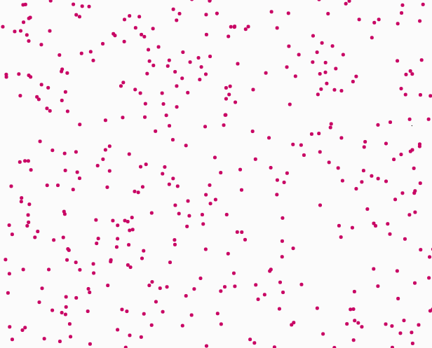
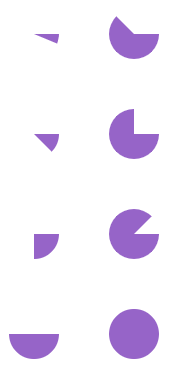
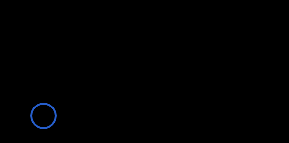

# Entry 3
##### 2/12/23

Over the past few weeks I have still been learning my tool, p5js. I have learned and practiced many more things. My two main sources are still the [p5js reference page](https://p5js.org/reference/) and [The Coding Train's p5js playlist](https://www.youtube.com/playlist?list=PLglp04UYZK_PrN6xWo_nJ-8kzyXDyFUw).

Since the last entry, the first things I did were basic shapes and their syntax. I learned how to make shapes like quadrilaterals, triangles, and circles in p5js with all of their unique syntax. One thing I did that was useful when practicing with the shapes was practicing plotting basic points on the canvas with `point(x,y);`. The point function simply takes in an x and a y value to plot on the canvas. Most if not all of the syntax for the other shapes would ask for at least one x and one y value to determine the location of the shape. However when looking through The Coding Train's videos I found a fun thing to code using the points that I decided to try out.

The video itself was mainly about a function in p5js called `random(min,max)`. The random function reminded me of math.random(); but except of picking a float between 0 and 1 it takes in a minimum and a maximum value to pick from inbetween. After learning this new function I immediently used `random();` to generate a number between 0 and 400 and then saved it into a variable that I used for both the x and y value of the `point();`. However the dots were not random and would form a linear decreasing line. I then decided to watch further into the video I was watching I noticed two differenced inbetween his and my code. The first difference is that they actually used `width` and `height` as parameters to fit to any canvas size. The second difference was that `random();` was used twice to make a variable of x and y to plug into the point parameters. 

After a while I realized what was wrong with my inital code. Since I was only doing `random();` once and used it for both x and y, it would use the same numerical value in the point for both x and y. So if the function chose 10 the point would be `point(10,10)` instead of the x and y being different and more random; this would explain the reason the dots seemed to form into a line. When I corrected my code I was happy to see the code functioning as planned and even added a bit of color.
```js
function setup() {
  background(0);
  createCanvas(400, 400);
}

function draw() {
  var x= random(0,width);
  var y=random(0,height);
  point(x,y);
  strokeWeight(5);
  stroke(200,5,100)
}
```






I am currently still in the 3rd(Brainstorming) and 4th(Planning) stages of the Engineering design process because I am currently preparing for the project by learning my tool, p5js. I would say I practiced many usefull skills such as logical reasoning because of the practice I did with conditionals and how I combined it with p5js. I also practiced learning and reading by reading the documentation for many of the shape functions and learning by coding them myself. I also practiced googling because of the stuff I had forgotten with PI. Finally I would say I practiced debugging because the stuff I coded contained a lot more code and values allowing room for errors that I had to catch.

I plan to next try learning 3D shapes such as boxes, planes, spheres, ect. I had already tried doing the box once with correct syntax but it didn't work. After skimming though the 3D stuff I figured that it will be the next thing I strive to learn because I think that there is a lot that comes along with the 3D shapes beyond just the functions for the shapes. I look forward to learning more about coding 3D objects onto the canvas.

[Previous](entry02.md) | [Next](entry04.md)

[Home](../README.md)
